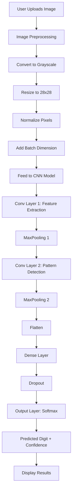

# 🔢 MNIST Digit Recognition with CNN

<div align="center">


*Deep Learning Handwritten Digit Recognition with 99% Accuracy*

</div>


A comprehensive web application that recognizes handwritten digits (0-9) using a Convolutional Neural Network trained on the MNIST dataset. Features dual deployment options with Flask and Streamlit, achieving ~99% accuracy with real-time predictions and neural network visualization.

---

## 🎯 Live Demo

<div align="center">

[](https://mnist-digit-recognition.streamlit.app/)

**[🚀 Launch Interactive Demo](https://MNIST-cls.streamlit.app/)**

*Experience real-time digit recognition with feature map visualization and comprehensive model insights!*

</div>

---

## 📋 Table of Contents

- [Features](#-features)
- [Demo](#-demo)
- [Model Architecture](#-model-architecture)
- [Dataset](#-dataset)
- [Deployment Options](#-deployment-options)
- [Installation](#-installation)
- [Usage](#-usage)
- [Project Structure](#-project-structure)
- [How It Works](#-how-it-works)
- [Feature Maps](#-feature-maps)
- [API Endpoints](#-api-endpoints)
- [Future Improvements](#-future-improvements)
- [Contributing](#-contributing)
- [License](#-license)
- [Contact](#-contact)

---

## ✨ Features

### 🎯 **Core Functionality**

- **High Accuracy**: ~99% accuracy on MNIST test dataset
- **Real-Time Predictions**: Instant digit recognition from uploaded images
- **Dual Interface**: Choose between Flask (lightweight) or Streamlit (feature-rich)
- **Feature Map Visualization**: See what the neural network "sees" at different layers
- **Interactive UI**: Modern, responsive design with baby blue theme
- **Confidence Scores**: Detailed probability distribution for all digits

### 🌐 **Flask Application Features**

- Minimalist, clean interface
- Drag & drop image upload
- Fast response times
- Feature map generation (4×8 and 8×8 grids)
- Automatic folder cleanup
- Static file serving

### 🎨 **Streamlit Application Features**

- **Multi-Page Layout**:
  - 🏠 Home - Digit Recognition
  - 📊 Model Information
  - ℹ️ About Project
  
- **Advanced Visualization**:
  - Interactive Plotly confidence charts
  - Matplotlib feature map displays
  - Preprocessed image preview
  - Real-time progress indicators

- **User Experience**:
  - Visitor counter tracking
  - Model statistics sidebar
  - Quick tips and guidance
  - Professional styling

### 📊 **Visualization & Analysis**

- **Feature Maps**: 
  - Conv Layer 1: 32 filters (4×8 grid)
  - Conv Layer 2: 64 filters (8×8 grid)
- **Confidence Charts**: Bar charts showing all digit probabilities
- **Preprocessed Image**: Display of 28×28 normalized input
- **Layer Activations**: Visual representation of neural network activations

---

## 🎬 Demo

<div align="center">


*Real-time digit recognition in action*


*Flask application interface*

</div>

---

## 🏗️ Model Architecture

### **CNN Architecture**

The model uses a custom Convolutional Neural Network optimized for MNIST digit classification:

```
┌─────────────────────────────────────────┐
│  Input Layer (28×28×1 Grayscale)        │
└─────────────────┬───────────────────────┘
                  │
┌─────────────────▼───────────────────────┐
│  Conv2D (32 filters, 3×3, ReLU)         │  ← Extract basic features
│  Named: 'conv1'                         │
└─────────────────┬───────────────────────┘
                  │
┌─────────────────▼───────────────────────┐
│  MaxPooling2D (2×2)                     │  ← Reduce spatial dimensions
└─────────────────┬───────────────────────┘
                  │
┌─────────────────▼───────────────────────┐
│  Conv2D (64 filters, 3×3, ReLU)         │  ← Extract complex patterns
│  Named: 'conv2'                         │
└─────────────────┬───────────────────────┘
                  │
┌─────────────────▼───────────────────────┐
│  MaxPooling2D (2×2)                     │
└─────────────────┬───────────────────────┘
                  │
┌─────────────────▼───────────────────────┐
│  Flatten                                │
└─────────────────┬───────────────────────┘
                  │
┌─────────────────▼───────────────────────┐
│  Dense (64 units, ReLU)                 │  ← Classification layers
└─────────────────┬───────────────────────┘
                  │
┌─────────────────▼───────────────────────┐
│  Dropout (0.5)                          │  ← Prevent overfitting
└─────────────────┬───────────────────────┘
                  │
┌─────────────────▼───────────────────────┐
│  Output Dense (10 units, Softmax)       │  ← Digit probabilities
└─────────────────────────────────────────┘
```

### **Model Specifications**

| Specification | Value |
|--------------|-------|
| **Architecture** | Custom CNN |
| **Input Shape** | 28×28×1 (grayscale) |
| **Total Parameters** | ~150,000 |
| **Model Size** | ~400KB |
| **Optimizer** | Adam |
| **Loss Function** | Categorical Crossentropy |
| **Batch Size** | 128 |
| **Test Accuracy** | ~99% |
| **Inference Time** | < 100ms |

### **Training Details**

- **Early Stopping**: Monitors validation loss with patience of 5 epochs
- **Learning Rate Reduction**: Reduces learning rate by factor of 0.5 when validation loss plateaus (patience=2)
- **Data Augmentation**: Applied during training for robustness
- **Validation Split**: 20% of training data used for validation

---

## 📊 Dataset

### **MNIST Dataset**

The **Modified National Institute of Standards and Technology (MNIST)** database is the world's most famous dataset for image classification and machine learning education.

<div align="center">


</div>

### **Dataset Statistics**

| Metric | Value |
|--------|-------|
| **Total Images** | 70,000 |
| **Training Set** | 60,000 images |
| **Test Set** | 10,000 images |
| **Image Size** | 28×28 pixels |
| **Color Mode** | Grayscale (1 channel) |
| **Classes** | 10 (digits 0-9) |
| **Distribution** | Balanced across all classes |

### **Dataset Characteristics**

- ✅ Normalized pixel values [0, 1]
- ✅ Centered digits in 28×28 frame
- ✅ Size-normalized (aspect ratio preserved)
- ✅ Anti-aliased grayscale images
- ✅ Real handwriting samples from diverse writers

### **Preprocessing Pipeline**

1. **Convert to Grayscale**: If image is RGB
2. **Resize**: Scale to 28×28 pixels
3. **Normalize**: Divide pixel values by 255.0
4. **Reshape**: Add channel dimension (28, 28, 1)
5. **Batch**: Add batch dimension for model input

---

## 🚀 Deployment Options

This project offers **two deployment options** to suit different use cases:

### **1. Flask Application** (Lightweight & Fast)

**Best for:**
- Production deployments
- REST API integration
- Minimal resource usage
- Custom frontend integration

**Features:**
- Simple, clean interface
- Fast response times
- Drag & drop upload
- Feature map generation
- Automatic cleanup

**Run Flask App:**
```bash
python app.py
```
Access at: `http://localhost:5000`

### **2. Streamlit Application** (Feature-Rich & Interactive)

**Best for:**
- Demonstrations and presentations
- Educational purposes
- Interactive exploration
- Rapid prototyping

**Features:**
- Multi-page layout
- Interactive visualizations
- Model information dashboard
- Real-time analytics
- Professional UI/UX

**Run Streamlit App:**
```bash
streamlit run streamlit_app.py
```
Access at: `http://localhost:8501`

---

## 🛠️ Installation

### **Prerequisites**

- Python 3.8 or higher
- pip package manager
- 50MB free disk space

### **Step-by-Step Installation**

1. **Clone the repository**
   ```bash
   git clone https://github.com/Mo-Abdalkader/mnist-digit-recognition.git
   cd mnist-digit-recognition
   ```

2. **Create virtual environment** (recommended)
   ```bash
   python -m venv venv
   
   # On Windows
   venv\Scripts\activate
   
   # On macOS/Linux
   source venv/bin/activate
   ```

3. **Install dependencies**
   
   For Flask application:
   ```bash
   pip install tensorflow pillow numpy matplotlib flask
   ```
   
   For Streamlit application:
   ```bash
   pip install streamlit tensorflow pillow numpy matplotlib plotly
   ```
   
   Or install all at once:
   ```bash
   pip install -r requirements.txt
   ```

4. **Verify model files**
   - Ensure the `models/` directory exists
   - Check for `mnist_model_final.keras`
   - Check for `mnist_feature_extractor.keras`

5. **Run your preferred application**
   
   Flask:
   ```bash
   python app.py
   ```
   
   Streamlit:
   ```bash
   streamlit run streamlit_app.py
   ```

---

## 📱 Usage

### **Flask Application Usage**

1. **Start the server**:
   ```bash
   python app.py
   ```

2. **Open browser**: Navigate to `http://localhost:5000`

3. **Upload image**:
   - Click "Select Image" button, or
   - Drag & drop an image onto the upload area

4. **View results**:
   - Predicted digit
   - Confidence percentage
   - Uploaded image (resized to 300×300)

5. **Explore feature maps**:
   - Click "View Feature Maps" button
   - See Conv Layer 1 (32 filters, 4×8 grid)
   - See Conv Layer 2 (64 filters, 8×8 grid)

6. **Try another image**:
   - Click "Try Another Image" to reset

### **Streamlit Application Usage**

#### **Home Page - Recognize Digit**

1. **Navigate** to "🏠 Home - Recognize Digit"

2. **Upload image**: Choose PNG, JPG, or JPEG file

3. **Configure options**:
   - ✅ Show Feature Maps
   - ✅ Show All Digit Confidences
   - ✅ Show Preprocessed Image

4. **Click** "🔍 Recognize Digit"

5. **Explore results**:
   - Large predicted digit display
   - Confidence percentage
   - Confidence progress bar
   - 28×28 preprocessed image
   - Interactive confidence chart (all digits)
   - Feature maps visualization (if enabled)

#### **Model Information Page**

1. **Navigate** to "📊 Model Information"

2. **Explore sections**:
   - Model Architecture details
   - Training configuration
   - Performance metrics
   - Feature extraction explanation

#### **About Page**

1. **Navigate** to "ℹ️ About"

2. **Learn about**:
   - Project overview
   - How it works
   - Technical stack
   - MNIST dataset info
   - Developer information

### **Tips for Best Results**

- 📝 Use clear, well-written digits
- ⚫ Black digit on white background works best
- 🎯 Center the digit in the image
- 📏 Keep digit size reasonable (not too small/large)
- 🧹 Avoid excessive noise or background clutter
- 🖊️ Single digit per image (no multi-digit numbers)

---

## 📂 Project Structure

```
mnist-digit-recognition/
│
├── app.py                      # Flask application
├── streamlit_app.py           # Streamlit application
├── requirements.txt            # Python dependencies
│
├── models/                     # Trained model files
│   ├── mnist_model_final.keras           # Main classifier
│   └── mnist_feature_extractor.keras     # Feature extraction model
│
├── static/                     # Flask static files
│   ├── css/
│   │   └── style.css          # Baby blue theme styling
│   ├── js/
│   │   └── main.js            # Frontend JavaScript
│   ├── uploads/               # Temporary uploaded images
│   ├── maps/                  # Generated feature maps
│   └── images/                # Documentation images
│       ├── APP_SCREENSHORT.jpg
│       └── MINST APP DEMO.gif
│
├── templates/                  # Flask HTML templates
│   ├── index.html             # Main page
│   └── feature_maps.html      # Feature maps page
│
├── MNIST Test Images/          # Sample test images
│
├── visitor_stats.json          # Visitor tracking (auto-generated)
├── .gitignore                 # Git ignore rules
├── LICENSE                    # MIT License
└── README.md                  # This file
```

---

## 🔍 How It Works

### **Step-by-Step Process**



### **Detailed Workflow**

1. **Image Upload**: User uploads handwritten digit image through web interface

2. **Preprocessing**:
   - Convert to grayscale (if RGB)
   - Resize to 28×28 pixels
   - Normalize pixel values to [0, 1]
   - Reshape to (1, 28, 28, 1)

3. **Feature Extraction** (Conv Layers):
   - **Layer 1**: 32 filters detect edges, lines, curves
   - **Layer 2**: 64 filters combine features into digit patterns

4. **Classification** (Dense Layers):
   - Flatten feature maps
   - 64-unit dense layer with ReLU
   - Dropout for regularization
   - 10-unit output with Softmax

5. **Prediction**:
   - Get probability distribution over 10 digits
   - Select highest probability as prediction
   - Calculate confidence percentage

6. **Visualization**:
   - Display predicted digit
   - Show confidence scores
   - Generate feature maps (optional)
   - Create interactive charts

---

## 🗺️ Feature Maps

### **What are Feature Maps?**

Feature maps are the outputs of convolutional layers, showing which parts of the image activate each filter. They reveal what patterns the neural network has learned to recognize.

### **Convolutional Layer 1 (32 Filters)**

<div align="center">


</div>

**What it detects:**
- **Edges**: Horizontal, vertical, diagonal lines
- **Curves**: Rounded segments
- **Basic Shapes**: Simple geometric patterns
- **Corners**: Angle intersections

**Visualization**: 4×8 grid (32 filters)

### **Convolutional Layer 2 (64 Filters)**

**What it detects:**
- **Digit Parts**: Top curves, bottom loops, middle bars
- **Complex Patterns**: Combinations of edges and curves
- **Structural Elements**: Features specific to certain digits
- **Abstract Representations**: High-level digit characteristics

**Visualization**: 8×8 grid (64 filters)

### **Interpreting Feature Maps**

- **Bright areas**: Strong activation (filter detects feature)
- **Dark areas**: Weak activation (feature not present)
- **Different filters**: Detect different aspects of the digit
- **Layer progression**: From simple edges to complex shapes

---

## 🔌 API Endpoints (Flask)

### **Available Routes**

| Method | Endpoint | Description |
|--------|----------|-------------|
| `GET` | `/` | Main page - image upload interface |
| `POST` | `/predict` | Upload image and get prediction |
| `GET` | `/feature_maps` | View generated feature maps |
| `GET` | `/reset` | Clear uploads and reset application |

### **Example API Usage**

```python
import requests

# Upload image for prediction
url = 'http://localhost:5000/predict'
files = {'image': open('digit.png', 'rb')}
response = requests.post(url, files=files)

# Parse results
result = response.json()
print(f"Predicted Digit: {result['predicted_digit']}")
print(f"Confidence: {result['confidence']:.2f}%")
print(f"Image Path: {result['image_path']}")
```

### **Response Format**

```json
{
  "predicted_digit": 7,
  "confidence": 99.23,
  "image_path": "static/uploads/digit.png"
}
```

---

## 🔮 Future Improvements

### **Planned Enhancements**

1. **Drawing Canvas**
   - Real-time digit drawing in browser
   - Instant predictions as user draws
   - Clear/reset functionality

2. **Model Enhancements**
   - Experiment with deeper architectures
   - Try ResNet or EfficientNet backbones
   - Ensemble multiple models
   - Quantization for faster inference

3. **Feature Additions**
   - Multi-digit recognition (entire numbers)
   - Batch processing for multiple images
   - User accounts and history
   - Confidence threshold settings
   - Export predictions to CSV/JSON

4. **Visualization**
   - Grad-CAM heatmaps
   - Layer activation animations
   - 3D feature map visualization
   - t-SNE embeddings of learned features

5. **Deployment**
   - Docker containerization
   - Kubernetes deployment
   - Mobile app (iOS/Android)
   - REST API with FastAPI
   - Real-time camera integration

6. **Data & Training**
   - Extended MNIST variants (Fashion-MNIST, EMNIST)
   - Transfer learning experiments
   - Data augmentation improvements
   - Active learning pipeline

7. **Performance**
   - TensorFlow Lite conversion
   - ONNX export for broader compatibility
   - GPU acceleration options
   - WebGL inference in browser

---

## 🤝 Contributing

Contributions are welcome and greatly appreciated! Here's how you can contribute:

### **How to Contribute**

1. **Fork** the repository
2. **Create** a feature branch
   ```bash
   git checkout -b feature/AmazingFeature
   ```
3. **Commit** your changes
   ```bash
   git commit -m 'Add some AmazingFeature'
   ```
4. **Push** to the branch
   ```bash
   git push origin feature/AmazingFeature
   ```
5. **Open** a Pull Request

### **Contribution Guidelines**

- Follow PEP 8 style guidelines
- Add unit tests for new features
- Update documentation
- Write clear commit messages
- Test thoroughly before submitting

### **Areas for Contribution**

- 🐛 Bug fixes
- ✨ New features
- 📝 Documentation improvements
- 🎨 UI/UX enhancements
- 🧪 Testing
- 🌐 Internationalization

---

## 📄 License

This project is licensed under the **MIT License** - see the [LICENSE](LICENSE) file for details.

### **MIT License Summary**

✅ Commercial use  
✅ Modification  
✅ Distribution  
✅ Private use  
❗ License and copyright notice required  
❌ Liability and warranty not provided  

---

## 📞 Contact

**Mohamed Abdalkader**

Passionate developer focused on AI, machine learning, and creating intuitive user experiences.

- 📧 **Email**: [Mohameed.Abdalkadeer@gmail.com](mailto:Mohameed.Abdalkadeer@gmail.com)
- 💼 **LinkedIn**: [mo-abdalkader](https://www.linkedin.com/in/mo-abdalkader/)
- 💻 **GitHub**: [Mo-Abdalkader](https://github.com/Mo-Abdalkader)

### **Get in Touch**

- 💬 Questions? Open an issue!
- 🤝 Want to collaborate? Send me a message!
- 🐛 Found a bug? Report it on GitHub!
- 💡 Have an idea? I'd love to hear it!

---

## 🙏 Acknowledgments

### **Special Thanks**

- **Yann LeCun** and team for creating the MNIST dataset
- **TensorFlow/Keras** teams for the excellent deep learning framework
- **Flask** developers for the lightweight web framework
- **Streamlit** team for making ML app development effortless
- **Open Source Community** for inspiration and resources
- **Stack Overflow** community for troubleshooting help

### **Resources & References**

- [MNIST Database](http://yann.lecun.com/exdb/mnist/)
- [TensorFlow Documentation](https://www.tensorflow.org/)
- [Keras Documentation](https://keras.io/)
- [Flask Documentation](https://flask.palletsprojects.com/)
- [Streamlit Documentation](https://docs.streamlit.io/)

---

## 📈 Project Statistics

- **Model Accuracy**: ~99%
- **Model Size**: ~400KB
- **Parameters**: ~150,000
- **Inference Time**: < 100ms
- **Supported Formats**: PNG, JPG, JPEG
- **Max Upload Size**: 16MB
- **Languages**: Python, JavaScript, HTML, CSS

---

## ⭐ Star History

If you find this project useful, please consider giving it a ⭐ on GitHub!

<div align="center">

[](https://github.com/Mo-Abdalkader/mnist-digit-recognition/stargazers)
[](https://github.com/Mo-Abdalkader/mnist-digit-recognition/network/members)

</div>

---

<div align="center">

**Made with ❤️ and 🧠 by Mohamed Abdalkader**

*Empowering machine learning education through practical applications*

</div>
